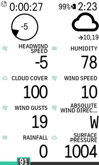
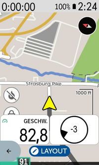
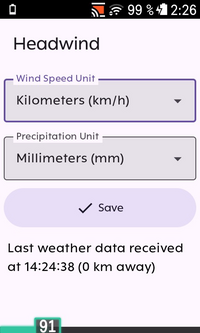

# Karoo Headwind Extension

This extension for Karoo devices adds a graphical data field that shows the current headwind direction and speed relative to the riding direction.

Compatible with Karoo 2 and Karoo 3 devices.

## Installation

If you are using a Karoo 3, you can use [Hammerhead's sideloading procedure](https://support.hammerhead.io/hc/en-us/articles/31576497036827-Companion-App-Sideloading) to install the app:

1. Open the [releases page](https://github.com/timklge/karoo-headwind/releases) on your phone's browser, long-press the `app-release.apk` link and share it with the Hammerhead Companion app.
2. Your karoo should show an info screen about the app now. Press "Install".
3. Open the app from the main menu and acknowledge the API usage note.
4. Set up your data fields as desired.

If you are using a Karoo 2, you can use manual sideloading:

1. Download the apk from the [releases page](https://github.com/timklge/karoo-headwind/releases) (or build it from source)
2. Set up your Karoo for sideloading. DC Rainmaker has a great [step-by-step guide](https://www.dcrainmaker.com/2021/02/how-to-sideload-android-apps-on-your-hammerhead-karoo-1-karoo-2.html).
3. Install the app by running `adb install app-release.apk`.
4. Open the app from the main menu and acknowledge the API usage note.
5. Set up your data fields as desired.

## Usage

After installing this app on your Karoo and opening it once from the main menu, you can add the following new data fields to your data pages:

- Headwind (graphical): Shows the headwind direction and speed as a circle with a triangular direction indicator. The speed is shown at the center in your set unit of measurement (default is kilometers per hour if you have set up metric units in your Karoo, otherwise miles per hour). Both direction and speed are relative to the current riding direction.
- Weather (graphical): Shows an icon indicating the current weather conditions (sunny, cloudy, ...). Additionally, current absolute wind direction, speed and wind gust speed are shown below the icon.
- Additionally, data fields that only show the current data value for headwind speed, humidity, cloud cover, absolute wind speed, absolute wind gust speed, absolute wind direction, rainfall and surface pressure can be added if desired.

The app will automatically attempt to download weather data for your current approximate location from the [open-meteo.com](https://open-meteo.com) API once your device has acquired a GPS fix. The API service is free for non-commercial use. Your location is rounded to approximately two kilometers to maintain privacy. The data is updated when you ride more than two kilometers from the location where the weather data was downloaded or after one hour at the latest. If the app cannot connect to the weather service, it will retry the download every minute. Downloading weather data should work on Karoo 2 if you have a SIM card inserted or on Karoo 3 via your phone's internet connection if you have the Karoo companion app installed.

## Credits

- Icons are from [boxicons.com](https://boxicons.com) ([MIT-licensed](icon_credits.txt))
- Made possible by the generous usage terms of [open-meteo.com](https://open-meteo.com)
- Uses [karoo-ext](https://github.com/hammerheadnav/karoo-ext) (Apache2-licensed)