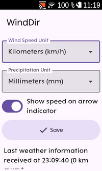

# Karoo Winddir Extension

> [!WARNING]  
> This app is currently in prototype stage and its main features might not work at all. If you want to test it anyway and encounter issues, please report them in the [issue tracker](https://github.com/timklge/karoo-winddir/issues), ideally with adb logs attached.

This extension for Karoo devices adds a graphical data field that shows the current wind direction relative to the rider as an arrow. It also provides data fields for relative humidity, cloud coverage, wind speed, wind gust speed, surface pressure, and rainfall at the current location.

Compatible with Karoo 2 and Karoo 3 devices running Karoo OS version 1.524.2003 and later.

## Installation

Currently, Hammerhead has not yet released an on-device app store for easy installation of extensions like this. Until then, you can sideload the app.

1. Download the APK from the [releases page](https://github.com/timklge/karoo-winddir/releases) (or build it from source).
2. Prepare your Karoo for sideloading by following the [step-by-step guide](https://www.dcrainmaker.com/2021/02/how-to-sideload-android-apps-on-your-hammerhead-karoo-1-karoo-2.html) by DC Rainmaker.
3. Install the app using the command `adb install app-release.apk`.

## Usage

After installing this app on your Karoo, you can add a data field showing the relative wind direction or one of the auxiliary fields to your data pages. The relative wind direction will be shown as an arrow image, with an optional overlay of the wind speed in your chosen unit of measurement (default is kilometers per hour).

The app will automatically attempt to download weather data for your current approximate location from the [open-meteo.com](https://open-meteo.com) API once your device has acquired a GPS fix. The API service is free for non-commercial use. Your location is rounded to approximately two kilometers to maintain privacy. The data is updated when you ride more than two kilometers from the location where the weather data was downloaded or after one hour at the latest. If the app cannot connect to the weather service, it will retry the download every minute. Downloading weather data should work on Karoo 2 if you have a SIM card inserted or on Karoo 3 via the companion app.

## Credits

Icons are from [boxicons.com](https://boxicons.com) (MIT-licensed).

## Links

[karoo-ext source](https://github.com/hammerheadnav/karoo-ext)